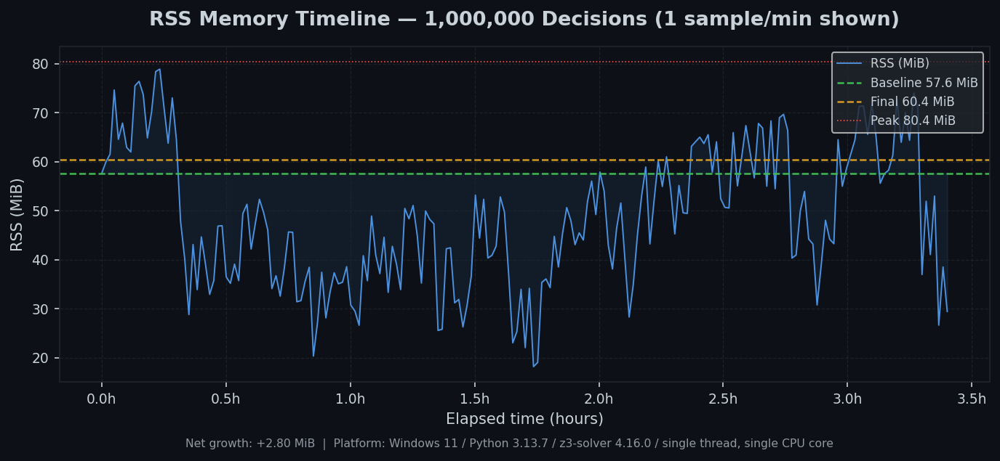
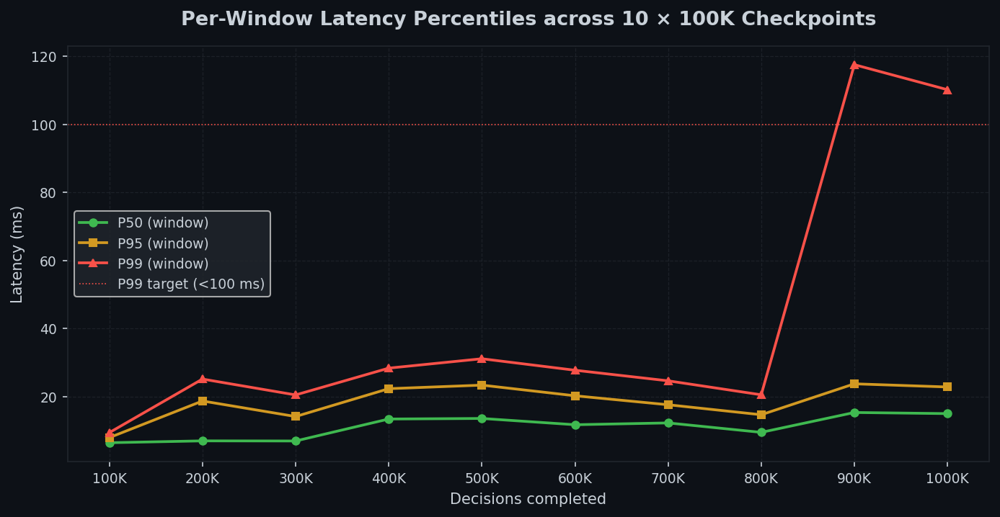
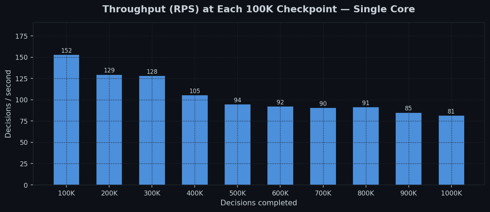
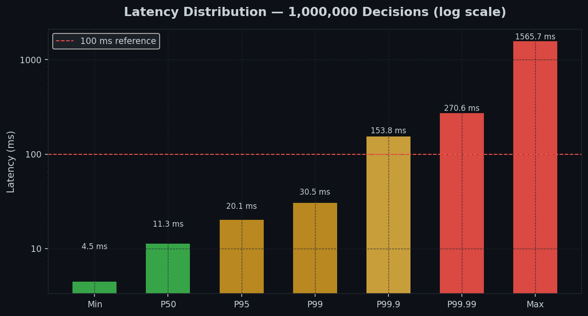
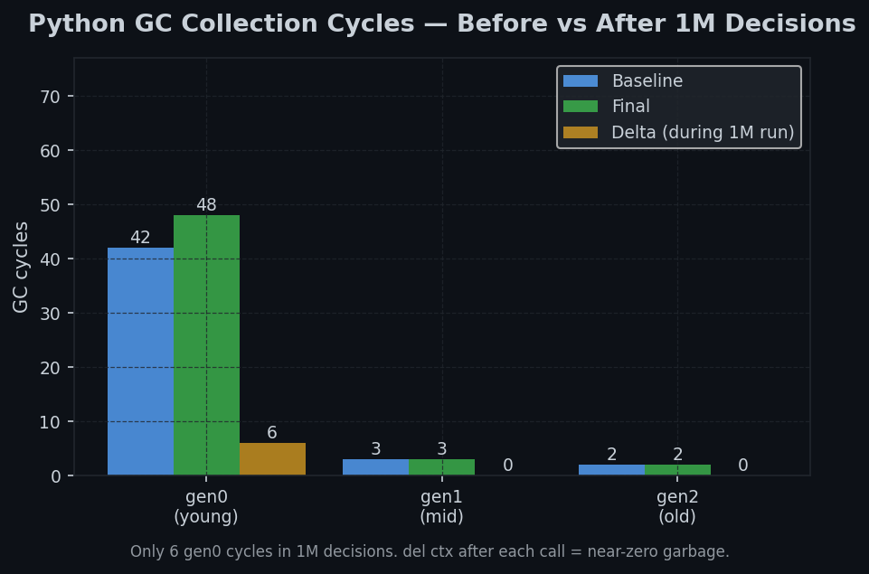

# Pramanix


**Safety guardrails for autonomous AI agents, backed by formal constraint verification.**

Pramanix sits between an AI agent and the real world. Before any action executes (a bank transfer, a Kubernetes deployment, a database write), Pramanix checks whether that action is mathematically allowed by a policy you define. Every ALLOW comes with a proof. Every BLOCK comes with a counterexample showing exactly which constraint was violated.

The name comes from Sanskrit: *Pramana* (प्रमाण) means "valid source of knowledge" or "proof."

---

## The Problem This Solves

Most AI guardrail systems are classifiers. They output a confidence score and compare it to a threshold. At scale, this creates a predictable failure rate:

- A 99.9% accurate classifier allows 1 in every 1,000 requests through incorrectly
- At 100 requests per second, that is 8,640 failures per day
- The failures are mathematically guaranteed, not edge cases
- An attacker can probe the threshold until they find inputs that score above it

Pramanix does not use confidence scores. It evaluates whether specific values satisfy specific constraints:

- `balance - amount >= 0` either holds or it does not
- Z3 returns SAT (the values satisfy all constraints) or UNSAT (they do not)
- The same inputs always produce the same result
- There is no threshold to probe and no probability involved

This approach trades the flexibility of an LLM classifier for the determinism of arithmetic. It is the right trade when the rule is clear and the consequences of failure are real.

---

## Install

```bash
# Not yet on PyPI. Install from source:
git clone https://github.com/virajjain1011/Pramanix.git
cd Pramanix
pip install -e .

# With specific extras
pip install -e '.[fastapi]'      # FastAPI/Starlette middleware and route decorator
pip install -e '.[langchain]'    # LangChain tool wrapping
pip install -e '.[llamaindex]'   # LlamaIndex query engine guard
pip install -e '.[autogen]'      # AutoGen agent wrapping
pip install -e '.[translator]'   # LLM extraction (Ollama, OpenAI, Anthropic)
pip install -e '.[audit]'        # Ed25519 signing and Merkle audit chain
pip install -e '.[identity]'     # JWT + Redis zero-trust identity
pip install -e '.[otel]'         # OpenTelemetry tracing
pip install -e '.[all]'          # All of the above

# Requirements
# Python 3.13+
# Alpine Linux is not supported (z3-solver is compiled against glibc; musl causes
# segfaults and 3-10x performance degradation). Use python:3.13-slim or ubuntu.
```

---

## Quick Start

```python
from decimal import Decimal
from pramanix import Guard, GuardConfig, Policy, Field, E

class BankingPolicy(Policy):
    class Meta:
        version = "1.0"

    amount          = Field("amount",          Decimal, "Real")
    balance         = Field("balance",         Decimal, "Real")
    daily_limit     = Field("daily_limit",     Decimal, "Real")
    minimum_reserve = Field("minimum_reserve", Decimal, "Real")
    is_frozen       = Field("is_frozen",       bool,    "Bool")

    @classmethod
    def invariants(cls):
        return [
            # Balance after transfer must be at or above the minimum reserve
            (E(cls.balance) - E(cls.amount) >= E(cls.minimum_reserve))
            .named("sufficient_funds")
            .explain("Insufficient balance: post-transfer balance would be "
                     "{balance} - {amount} = {post_balance}, minimum is {minimum_reserve}"),

            # Transfer amount must not exceed the daily limit
            (E(cls.amount) <= E(cls.daily_limit))
            .named("daily_limit_check")
            .explain("Amount {amount} exceeds daily limit {daily_limit}"),

            # Account must not be frozen
            (E(cls.is_frozen) == False)
            .named("account_not_frozen")
            .explain("Account is frozen. Contact support to unfreeze."),
        ]

guard = Guard(BankingPolicy, GuardConfig())

# ALLOW -- all three constraints satisfied
decision = guard.verify(
    intent={"amount": Decimal("500")},
    state={
        "balance":         Decimal("1000"),
        "daily_limit":     Decimal("2000"),
        "minimum_reserve": Decimal("0.01"),
        "is_frozen":       False,
    }
)

print(decision.allowed)              # True
print(decision.status)               # SolverStatus.SAFE
print(decision.status.value)         # "safe"

# BLOCK -- overdraft attempt
decision = guard.verify(
    intent={"amount": Decimal("1500")},
    state={
        "balance":         Decimal("1000"),
        "daily_limit":     Decimal("2000"),
        "minimum_reserve": Decimal("0.01"),
        "is_frozen":       False,
    }
)

print(decision.allowed)              # False
print(decision.violated_invariants)  # ("sufficient_funds",)
print(decision.explanation)          # "Insufficient balance: post-transfer balance would be
                                     #  1000 - 1500 = -500, minimum is 0.01"
```

---

## Known Limitations

**TOCTOU (Time-of-Check vs Time-of-Use):**
Pramanix verifies state at the moment `verify()` is called, not at execution time. In concurrent systems, two requests can both pass verification and then both execute against the same shared resource. Mitigate this with optimistic locking or transactional commit at the execution layer. The `ExecutionToken` (one-time-use HMAC token) reduces the window but does not eliminate the TOCTOU gap if execution is not atomic.

**Z3 encoding scope:**
Z3 verifies that the submitted values satisfy your declared constraints. It does not verify that state was accurately fetched from your database, that the intent dict matches what the executor will actually do, or that your invariants fully capture your safety requirements. Invariants should be reviewed by domain experts before deployment in regulated environments.

**Z3 native crashes in sync and async-thread modes:**
Python's `except Exception` cannot catch a Z3 C++ segfault (SIGABRT/SIGSEGV). In `async-process` mode, a worker process crash surfaces as a fail-safe BLOCK and the host process is unaffected. Use `async-process` in production.

**Z3 string theory performance:**
The `String` sort uses Z3 sequence theory, which is decidable but slower than arithmetic sorts. For string-heavy policies, prefer integer-encoded enumerations and `.is_in()` membership checks. Tune `solver_timeout_ms` accordingly if string constraints are necessary.

**Merkle anchor persistence:**
`MerkleAnchor` is process-scoped. Export `root_hash` to an append-only store at every checkpoint for cross-restart durability. Individual Ed25519-signed decision records remain independently verifiable without the chain.

**Phase 1 injection threshold:**
When `parse_and_verify()` is used, the injection confidence threshold (score >= 0.5 triggers `InjectionBlockedError`) is currently hardcoded. Phase 2 (Z3) is the binding safety guarantee regardless of Phase 1 outcome.

**Small LLM models:**
`llama3.2:1b` (1 billion parameters) cannot reliably perform structured intent extraction -- it echoes the schema instead of filling it in. Use `llama3.2` (3B) or larger.

---

## How It Works

Pramanix runs in two phases:

**Phase 1 (Optional): Intent Extraction**
- Accepts free-form text from the AI agent
- Two independent LLMs extract structured fields in parallel
- Both must agree on every field value (consensus check)
- Six-layer injection defense: NFKC normalization, parallel extraction, partial-failure gate, Pydantic strict validation, consensus check, injection confidence score
- If the models disagree or the confidence score exceeds the threshold, the request is blocked before reaching Phase 2

**Phase 2 (Always runs): Z3 Formal Verification**
- Receives a typed dict of field values
- Checks those values against every constraint in your policy
- Returns ALLOW if all constraints are satisfied (with proof), or BLOCK with the list of violated constraints and their counterexamples
- This phase cannot be bypassed by anything in the input text, because the policy is compiled to Z3 AST at startup before any request arrives

The policy is a Python class. No separate configuration language is required.

---

## Architecture

```
AI Agent
    │
    │  intent (structured dict OR free-form text)
    ▼
┌───────────────────────────────────────────────────────────────┐
│  Phase 1: Intent Extraction (optional)                        │
│                                                               │
│  Raw text ──► NFKC normalize ──► LLM-A  ──► Pydantic         │
│                                  LLM-B  ──► Pydantic         │
│                                    │                          │
│                              Consensus check                  │
│                              Injection score                  │
│                                    │                          │
│                   FAIL ◄──────────┤──────────► PASS          │
│               BLOCK (consensus     │            │             │
│                 / injection)       ▼            ▼             │
└──────────────────────────  typed intent dict ───┤────────────-┘
                                                  │
┌─────────────────────────────────────────────────▼─────────────┐
│  Phase 2: Z3 Formal Verification (always runs)                │
│                                                               │
│  policy.invariants() ──► Transpiler ──► Z3 AST               │
│  (compiled once at Guard.__init__)                            │
│                                                               │
│  intent dict + state ──► Solver (per-call Z3 Context)        │
│                                │                              │
│                    SAT?        │        UNSAT?                 │
│                    ▼           │           ▼                  │
│              ALLOW + proof     │     BLOCK + counterexample   │
│                                │     + violated invariants    │
└────────────────────────────────│───────────────────────────────┘
                                 │
                          Decision object
                         (immutable, signed)
```

**Key design properties:**
- Phase 2 always runs regardless of Phase 1 outcome
- Policy compilation happens once at startup, not per-request
- Each Z3 solve uses an isolated `z3.Context()`, deleted after the call
- Fail-safe: any exception in any path returns `Decision(allowed=False)`
- `allowed=True` is unreachable from any error path

---

## Policy DSL

### Fields

```python
from decimal import Decimal
from pramanix import Field

# Field(name, python_type, z3_sort)
# Z3 sorts: "Real" (exact rational), "Int", "Bool", "String" (Z3 sequence theory)

amount    = Field("amount",    Decimal, "Real")   # Decimal values are converted to exact
balance   = Field("balance",   Decimal, "Real")   # Z3 rationals via as_integer_ratio()
role      = Field("role",      int,     "Int")    # No IEEE 754 floating-point ever reaches Z3
active    = Field("active",    bool,    "Bool")
status    = Field("status",    str,     "String")
```

### Expressions

```python
from pramanix import E

# E() wraps a Field for use in constraint expressions

# Arithmetic (Real and Int sorts)
E(cls.balance) - E(cls.amount) >= Decimal("0")
E(cls.amount) * E(cls.quantity) <= E(cls.budget)
E(cls.price) / E(cls.quantity) > Decimal("0.01")

# Comparison
E(cls.risk_score) < Decimal("0.85")
E(cls.role) == 2
E(cls.amount) != Decimal("0")

# Boolean
E(cls.is_active) == True
~E(cls.is_frozen)

# Logical composition
(E(cls.amount) > 0) & (E(cls.amount) <= E(cls.limit))
(E(cls.role) == 1) | (E(cls.role) == 2)

# Membership check (preferred for string/int enumerations)
E(cls.status).is_in(["CLEAR", "VERIFIED"])
E(cls.role).is_in([1, 2, 3])
```

### Invariant Modifiers

```python
(E(cls.balance) - E(cls.amount) >= 0)
    .named("sufficient_funds")             # label used in violated_invariants
    .explain("Balance {balance} insufficient for amount {amount}")  # template in decision
```

### Decision Object

```python
decision.allowed               # bool -- True (ALLOW) or False (BLOCK)
decision.status                # SolverStatus enum
decision.violated_invariants   # tuple[str, ...] -- named labels of failed constraints (BLOCK path)
decision.explanation           # str -- human-readable reason, templates filled in
decision.decision_id           # UUID4 -- unique per decision
decision.policy_hash           # SHA-256 of the compiled policy
decision.solver_time_ms        # float -- Z3 solve time in milliseconds
decision.signature             # bytes | None -- Ed25519 signature (if signer configured)
decision.decision_hash         # str -- SHA-256 of canonical decision JSON

# Factory classifiers (all return allowed=False)
Decision.safe(...)             # allowed=True, status=SAFE
Decision.unsafe(...)           # allowed=False, status=UNSAFE
Decision.timeout(...)          # Z3 exceeded solver_timeout_ms or solver_rlimit
Decision.rate_limited(...)     # Load shedder rejected the request
Decision.consensus_failure()   # Phase 1 dual-model disagreement
```

### SolverStatus Values

| Status | `allowed` | Meaning |
|--------|-----------|---------|
| `SAFE` | `True` | All invariants satisfied. Z3 returned SAT. |
| `UNSAFE` | `False` | One or more invariants violated. Z3 returned UNSAT. |
| `TIMEOUT` | `False` | Z3 hit `solver_timeout_ms` or `solver_rlimit`. Request blocked. |
| `VALIDATION_ERROR` | `False` | Input failed Pydantic validation before reaching Z3. |
| `RATE_LIMITED` | `False` | Load shedder rejected the request (pool or latency limit exceeded). |
| `CONSENSUS_FAILURE` | `False` | Phase 1: dual-model LLM disagreement on extracted values. |
| `INJECTION_BLOCKED` | `False` | Phase 1: injection confidence score >= 0.5. |
| `ERROR` | `False` | Unexpected internal exception. Fail-safe path. |

### @guard Decorator

```python
from pramanix.decorator import guard

@guard(
    policy=BankingPolicy,
    config=GuardConfig(execution_mode="sync"),
    state_loader=lambda intent: fetch_account_state(intent["account_id"]),
)
def execute_transfer(intent: dict) -> dict:
    # Only runs if Guard.verify() returned ALLOW
    return transfer_service.execute(intent)

# Raises GuardViolationError on BLOCK
result = execute_transfer({"amount": Decimal("100"), "account_id": "acc-123"})
```

---

## Guard Configuration

```python
from pramanix import Guard, GuardConfig
from pramanix.crypto import PramanixSigner

guard = Guard(
    BankingPolicy,
    GuardConfig(
        # Execution mode
        execution_mode           = "async-process",  # "sync" | "async-thread" | "async-process"
        max_workers              = 8,
        max_decisions_per_worker = 10_000,           # workers recycle after this count

        # Z3 solver limits
        solver_timeout_ms        = 100,              # hard stall budget (ms)
        solver_rlimit            = 10_000_000,       # Z3 elementary operation cap

        # Phase 12 hardening
        max_input_bytes          = 65_536,           # 64 KiB -- reject oversized payloads
        min_response_ms          = 50.0,             # timing floor -- prevents timing analysis
        redact_violations        = False,            # True for external APIs
        expected_policy_hash     = fingerprint,      # detect policy drift in production

        # Cryptographic audit signing
        signer                   = PramanixSigner.from_pem(key_pem),

        # Resilience
        shed_worker_pct          = 90.0,             # shed when pool utilisation > 90%
        shed_latency_threshold_ms= 200.0,            # shed when rolling P99 > 200ms

        # Observability
        metrics_enabled          = True,             # Prometheus counters and histograms
        otel_enabled             = True,             # OpenTelemetry spans
        log_level                = "INFO",

        # Phase 1 (optional)
        translator_enabled       = False,
    ),
)
```

**Configuration notes:**

- `solver_timeout_ms` default is 5,000 ms. Never use the default in production. A 5-second timeout cascades stalls through the load shedder and trips the circuit breaker under adversarial non-linear inputs. Set to 100-150 ms for a P99 target of 15 ms.
- `solver_rlimit` caps Z3 elementary operations. When this limit is hit, Z3 returns `unknown` regardless of wall-clock time. Use both `solver_timeout_ms` and `solver_rlimit` together for defense against complex formula attacks.
- `min_response_ms` pads BLOCK responses to a minimum wall-clock time. Prevents an attacker from using response timing to determine whether a request was blocked by fast-path evaluation or by Z3.
- `expected_policy_hash` pins the compiled policy fingerprint. If the policy changes after deployment (code change, dependency update), Guard raises `PolicyDriftError` at startup.
- `redact_violations` controls whether `violated_invariants` and `explanation` are included in the Decision. Set to `True` for external APIs to avoid leaking policy internals.
- All fields are overridable via `PRAMANIX_<FIELD_NAME_UPPER>` environment variables.

---

## Execution Modes

### sync

```python
GuardConfig(execution_mode="sync")
```

- Z3 runs in the calling thread
- No worker pool
- Good for scripts, tests, and single-threaded WSGI applications
- A slow Z3 call blocks the entire thread
- A Z3 C++ fault (SIGABRT/SIGSEGV) crashes the process

### async-thread

```python
GuardConfig(execution_mode="async-thread", max_workers=8)
```

- Z3 runs in a `ThreadPoolExecutor`
- The event loop is never blocked
- Safe for concurrent async applications (FastAPI, aiohttp)
- Workers share memory; a Z3 C++ fault crashes the entire process

### async-process (recommended for production)

```python
GuardConfig(execution_mode="async-process", max_workers=8)
```

- Z3 runs in isolated subprocess workers (`ProcessPoolExecutor`)
- Worker death surfaces as a fail-safe BLOCK; the host process is unaffected
- Every result is HMAC-sealed before crossing the IPC boundary
- The host verifies the seal before accepting any decision
- Worker lifecycle:

```
spawn (not fork) --> warmup (8-pattern Z3 solve) --> serve decisions
                                                          |
                                          max_decisions_per_worker reached
                                                          |
                                              drain with grace period
                                                          |
                                              force-kill remaining processes
                                                          |
                                              spawn fresh worker
```

- The warmup solve runs 8 constraint patterns to eliminate Z3 cold-start JIT latency before the first real request arrives
- Workers are spawned, never forked, to avoid inheriting parent process file descriptors and state

---

## Neuro-Symbolic Mode (Phase 1 + Phase 2)

Phase 1 is optional. Use `parse_and_verify()` when the AI agent provides free-form text instead of a structured dict.

```python
# Dual-model consensus (recommended)
decision = await guard.parse_and_verify(
    prompt="transfer 500 dollars to alice",
    intent_schema=TransferIntent,           # Pydantic model defining expected fields
    state=account_state,
    models=("gpt-4o", "claude-opus-4-6"),   # both must agree on every field value
)
```

### Phase 1 Injection Defense Pipeline

```
Untrusted text
      |
      v
1. NFKC normalization       -- collapses Unicode homoglyphs (Cyrillic "a" = Latin "a")
      |
      v
2. Parallel LLM extraction  -- both models extract independently, no cross-contamination
      |
      v
3. Partial-failure gate     -- if either model errors, result = CONSENSUS_FAILURE
      |
      v
4. Pydantic strict validate -- extra fields rejected, types enforced, ranges checked
      |
      v
5. Consensus check          -- field-by-field value agreement required across both models
      |
      v
6. Injection confidence     -- signal-weighted additive score in [0, 1]
                               score >= 0.5 --> InjectionBlockedError (BLOCK)
      |
      v
Phase 2 (Z3) -- always runs regardless of Phase 1 outcome
```

- If an attacker manipulates one LLM to extract `amount=999999999`, the other model will extract a different value. Consensus check fails. BLOCK.
- If both models are manipulated to agree on `amount=999999999`, Phase 2 still runs. Z3 checks `balance - 999999999 >= minimum_reserve`. With `balance=1000`, this is UNSAT. BLOCK.

### Supported Translators

| Translator | Backend |
|-----------|---------|
| `OllamaTranslator` | Local Ollama server (tested: llama3.2 3B at temperature=0.0) |
| `OpenAICompatTranslator` | OpenAI API or any OpenAI-compatible endpoint |
| `AnthropicTranslator` | Anthropic Messages API |
| `RedundantTranslator` | Wraps any two translators for dual-model consensus |

```python
from pramanix.translator.ollama import OllamaTranslator
from pramanix.translator.anthropic import AnthropicTranslator
from pramanix.translator.redundant import RedundantTranslator

local = OllamaTranslator("llama3.2", base_url="http://localhost:11434")
cloud = AnthropicTranslator("claude-opus-4-6")

# Both must agree or the result is CONSENSUS_FAILURE
translator = RedundantTranslator(local, cloud)
```

**Note on small models:** `llama3.2:1b` (1B parameters) cannot reliably perform structured intent extraction -- it echoes the schema instead of filling it in. Use `llama3.2` (3B, Q4_K_M) or a larger model. `temperature=0.0` is set by default for deterministic extraction.

### Intent Cache

```python
GuardConfig(
    translator_enabled=True,
    # PRAMANIX_INTENT_CACHE_REDIS_URL=redis://localhost:6379
    # PRAMANIX_INTENT_CACHE_TTL_SECONDS=3600
    # PRAMANIX_INTENT_CACHE_MAX_SIZE=1024
)
```

- Repeated identical prompts hit the in-process LRU cache or Redis cache, skipping LLM inference
- Cache failures degrade silently -- a miss always falls through to full extraction and Z3
- Cache is best-effort and never blocks verification

---

## Primitives Library

Pre-built constraint factories. Import and compose directly into a policy's `invariants()` list. All 38 primitives emit named labels that appear in `violated_invariants` on BLOCK.

### Finance (`pramanix.primitives.finance`)

| Primitive | DSL constraint | Regulatory note |
|-----------|---------------|-----------------|
| `NonNegativeBalance(balance, amount)` | `balance - amount >= 0` | |
| `MinimumReserve(balance, amount, reserve)` | `balance - amount >= reserve` | |
| `UnderDailyLimit(amount, daily_limit)` | `amount <= daily_limit` | |
| `UnderSingleTxLimit(amount, single_tx_limit)` | `amount <= single_tx_limit` | |
| `RiskScoreBelow(risk_score, threshold)` | `risk_score < threshold` | |
| `SecureBalance(balance)` | `balance >= 0` | |

### FinTech / AML (`pramanix.primitives.fintech`)

| Primitive | DSL constraint | Regulatory note |
|-----------|---------------|-----------------|
| `SufficientBalance(balance, amount)` | `balance >= amount` | |
| `AntiStructuring(cumulative, threshold)` | `cumulative < threshold` | 31 CFR § 1020.320 CTR filing |
| `VelocityCheck(tx_count_24h, max_velocity)` | `tx_count_24h <= max_velocity` | PSD2 velocity cap |
| `KYCTierCheck(kyc_tier, required_tier)` | `kyc_tier >= required_tier` | FinCEN CDD rule |
| `SanctionsScreen(counterparty_status)` | `status not in ["SANCTIONED", "BLOCKED"]` | OFAC SDN |
| `MarginRequirement(collateral, requirement)` | `collateral >= requirement` | |
| `CollateralHaircut(collateral, haircut, exposure)` | `collateral * (1 - haircut) >= exposure` | |
| `MaxDrawdown(drawdown, max_pct)` | `drawdown <= max_pct` | |
| `WashSaleDetection(time_since_last_sale, window)` | `time_since_last_sale >= window` | |
| `TradingWindowCheck(timestamp, open, close)` | `open <= timestamp <= close` | |

### RBAC (`pramanix.primitives.rbac`)

| Primitive | DSL constraint |
|-----------|---------------|
| `RoleMustBeIn(role, allowed_roles)` | `role in allowed_roles` |
| `DepartmentMustBeIn(dept, allowed_depts)` | `dept in allowed_depts` |
| `ConsentRequired(consent_given)` | `consent_given == True` |

### Infrastructure (`pramanix.primitives.infra`)

| Primitive | DSL constraint |
|-----------|---------------|
| `MinReplicas(replicas, min_replicas)` | `replicas >= min_replicas` |
| `MaxReplicas(replicas, max_replicas)` | `replicas <= max_replicas` |
| `ReplicaBudget(replicas, min, max)` | `min <= replicas <= max` |
| `WithinCPUBudget(cpu_request, cpu_limit)` | `cpu_request <= cpu_limit` |
| `WithinMemoryBudget(mem_request, mem_limit)` | `mem_request <= mem_limit` |
| `CPUMemoryGuard(cpu_req, cpu_lim, mem_req, mem_lim)` | Combined CPU + memory |
| `ProdDeployApproval(approval_count, required)` | `approval_count >= required` |
| `CircuitBreakerState(circuit_state)` | `circuit_state != "open"` |
| `BlastRadiusCheck(affected, max_blast)` | `affected <= max_blast` |

### Healthcare (`pramanix.primitives.healthcare`)

| Primitive | DSL constraint | Regulatory note |
|-----------|---------------|-----------------|
| `PHILeastPrivilege(role, allowed_roles)` | `role in allowed_roles` | HIPAA 45 CFR § 164.502(b) |
| `ConsentActive(status, expiry, current_epoch)` | `status == "ACTIVE" and now < expiry` | HIPAA § 164.508(b)(5) |
| `BreakGlassAuth(flag, auth_code_present)` | `not flag or auth_code_present` | HIPAA § 164.312(a)(2)(ii) |
| `PediatricDoseBound(dose, max_per_kg, weight)` | `dose <= max_per_kg * weight` | |
| `DosageGradientCheck(dose, previous, max_step)` | `abs(dose - previous) <= max_step` | |

### Time (`pramanix.primitives.time`)

| Primitive | DSL constraint |
|-----------|---------------|
| `Before(timestamp, deadline)` | `timestamp < deadline` |
| `After(timestamp, start)` | `timestamp > start` |
| `WithinTimeWindow(timestamp, start, end)` | `start <= timestamp <= end` |
| `NotExpired(now, expiry)` | `now < expiry` |

### Common (`pramanix.primitives.common`)

| Primitive | DSL constraint |
|-----------|---------------|
| `NonNegative(field)` | `field >= 0` |
| `Positive(field)` | `field > 0` |
| `InRange(field, low, high)` | `low <= field <= high` |

### Composition example

```python
from pramanix.primitives.finance import NonNegativeBalance, UnderDailyLimit
from pramanix.primitives.rbac import RoleMustBeIn
from pramanix.primitives.time import NotExpired

class TradingPolicy(Policy):
    class Meta:
        version = "2.1"

    amount      = Field("amount",       Decimal, "Real")
    balance     = Field("balance",      Decimal, "Real")
    daily_limit = Field("daily_limit",  Decimal, "Real")
    role        = Field("role",         str,     "String")
    token_expiry= Field("token_expiry", int,     "Int")
    now         = Field("now",          int,     "Int")

    @classmethod
    def invariants(cls):
        return [
            NonNegativeBalance(cls.balance, cls.amount),
            UnderDailyLimit(cls.amount, cls.daily_limit),
            RoleMustBeIn(cls.role, ["trader", "desk_head"]),
            NotExpired(cls.now, cls.token_expiry),
        ]
```

---

## Integration Adapters

### FastAPI / Starlette

```python
from fastapi import FastAPI
from pramanix.integrations.fastapi import PramanixMiddleware, pramanix_route
from pramanix.guard import GuardConfig

app = FastAPI()

# Option 1: middleware -- applies to all routes under the registered path
async def load_account_state(request):
    account_id = request.headers["X-Account-Id"]
    return await db.get_account(account_id)

app.add_middleware(
    PramanixMiddleware,
    policy=BankingPolicy,
    intent_model=TransferIntent,        # Pydantic model for request body validation
    state_loader=load_account_state,
    config=GuardConfig(execution_mode="async-thread"),
    max_body_bytes=65_536,              # body size cap before any parsing
    timing_budget_ms=50.0,             # pad BLOCK responses to 50 ms
)

# Option 2: per-route decorator -- different policies per endpoint
@app.post("/transfer")
@pramanix_route(
    policy=BankingPolicy,
    intent_model=TransferIntent,
    state_loader=lambda req: fetch_account(req.headers["X-Account-Id"]),
)
async def transfer_handler(request: Request):
    # Only runs if Guard.verify() returned ALLOW
    return {"status": "ok"}
```

Request pipeline for both options:
1. Check `Content-Type: application/json` (415 if absent)
2. Read body, reject if over `max_body_bytes` (413)
3. Parse JSON (422 if invalid)
4. Validate intent via `intent_model.model_validate(raw, strict=True)` (422 if invalid)
5. Load state via `state_loader(request)` (500 if raises)
6. Run `Guard.verify_async(intent, state)`
7. BLOCK: pad to `timing_budget_ms`, return 403 with decision JSON
8. ALLOW: forward to next ASGI handler

### LangChain

```python
from pramanix.integrations.langchain import PramanixGuardedTool, wrap_tools

# Option 1: wrap a single tool function
guarded_transfer = PramanixGuardedTool(
    name="transfer_funds",
    description="Transfer money between accounts",
    policy=BankingPolicy,
    state_loader=get_account_state,
    tool_fn=execute_transfer,
)

# Option 2: wrap a list of existing LangChain tools
safe_tools = wrap_tools(
    [some_tool, another_tool],
    policy=BankingPolicy,
    state_loader=get_state,
)

# On BLOCK, the tool raises an exception -- LangChain routes it back to the agent as a tool error
```

### LlamaIndex

```python
from pramanix.integrations.llamaindex import PramanixGuardedQueryEngine

guarded_engine = PramanixGuardedQueryEngine(
    query_engine=base_engine,
    policy=PHIAccessPolicy,
    state_loader=lambda query: {
        "requestor_role": get_current_user_role(),
        "consent_active": check_consent(),
    },
)

# Guard runs BEFORE retrieval -- PHI documents are never fetched for unauthorized users
response = guarded_engine.query("What is the patient's diagnosis?")
```

### AutoGen

```python
from pramanix.integrations.autogen import PramanixGuardedAgent

guarded_agent = PramanixGuardedAgent(
    agent=base_agent,
    policy=InfraPolicy,
    state_loader=lambda: get_cluster_state(),
)

# All tool calls made by this agent go through Guard.verify() before execution
# In multi-agent setups: each agent has its own Guard instance
# A compromised Agent A cannot make Agent B exceed its own policy limits
```

---

## Zero-Trust Identity

```python
from pramanix.identity.linker import JWTIdentityLinker
from pramanix.identity.redis_loader import RedisStateLoader
import redis.asyncio as aioredis

client = aioredis.from_url("redis://localhost:6379")
loader = RedisStateLoader(redis_client=client)
linker = JWTIdentityLinker(
    state_loader=loader,
    jwt_secret="your-32-char-minimum-hmac-secret",
)

# State is loaded from Redis using only the verified JWT sub claim.
# Any state submitted in the request body is ignored.
claims, state = await linker.extract_and_load(request)

decision = await guard.verify_async(
    intent={"amount": Decimal(request.body["amount"])},
    state=state,   # from Redis, not from request body
)
```

- The caller cannot inject their own state. Even if the request body contains `{"balance": 999999}`, the system loads `balance` from Redis using the cryptographically verified JWT subject.
- JWT validation checks: HMAC-SHA256 signature (minimum 32-character secret), `exp` claim expiry, and tamper detection on any payload modification.
- Tested in `tests/integration/test_zero_trust_identity.py` against a real Redis instance via testcontainers.

---

## Execution Tokens

One-time-use, HMAC-signed tokens that prove a specific ALLOW decision was issued and has not been used before. Prevents replaying an old ALLOW decision for a different operation.

```python
from pramanix.execution_token import ExecutionTokenSigner, ExecutionTokenVerifier

signer   = ExecutionTokenSigner(secret_key=b"32-byte-minimum-hmac-key-here!!!!")
verifier = ExecutionTokenVerifier(secret_key=b"32-byte-minimum-hmac-key-here!!!!")

# After an ALLOW decision:
token = signer.sign(decision, operation="transfer", amount="500")

# Before executing the action:
verified = verifier.verify_and_consume(token)
# Second call with same token raises TokenAlreadyUsedError

# For multi-server deployments (replay-safe across restarts):
from pramanix.execution_token import RedisExecutionTokenVerifier
verifier = RedisExecutionTokenVerifier(
    secret_key=b"32-byte-minimum-hmac-key-here!!!!",
    redis_client=redis_client,
)
```

- The token includes: `decision_id`, `allowed`, `intent_dump`, `policy_hash`, `expires_at`, a 16-byte random nonce, and an HMAC-SHA256 signature.
- In-process verifier uses a `threading.Lock`. Note: the in-memory consumed-set is not shared across processes. Use `RedisExecutionTokenVerifier` in multi-process or multi-server deployments.

---

## Audit System

### Cryptographic Decision Signing

```python
from pramanix.crypto import PramanixSigner, PramanixVerifier

# Generate a keypair (save private key to secrets manager)
signer = PramanixSigner.generate()

# Or load from PEM (from environment or secrets manager)
signer = PramanixSigner.from_pem(os.environ["PRAMANIX_SIGNING_KEY_PEM"].encode())

# Pass to GuardConfig to sign every decision
config = GuardConfig(signer=signer)

# Verify offline with only the public key
verifier = PramanixVerifier.from_public_pem(public_pem)
verifier.verify(decision)   # raises InvalidSignatureError if tampered
```

- Uses Ed25519 (64-byte signature per decision)
- `decision_hash`: SHA-256 over canonical JSON of all decision fields (sorted keys, `orjson` serialization)
- Any modification to any field produces a completely different hash
- `key_id`: first 16 hex characters of SHA-256 of the public PEM, stored in each decision for key rotation tracking
- Verification requires only the public key -- no Pramanix SDK, no network connection

### Merkle Audit Chain

```python
from pramanix.audit.merkle import MerkleAnchor, PersistentMerkleAnchor

# Process-scoped (in-memory)
anchor = MerkleAnchor()
anchor.append(decision_1)
anchor.append(decision_2)

root_hash = anchor.root()   # SHA-256 Merkle root
proof     = anchor.proof(1) # inclusion proof for decision at index 1

# Persistent (cross-restart durability)
anchor = PersistentMerkleAnchor(store=your_append_only_store)
```

- Rolling SHA-256 hash chain: each chain hash depends on the previous one
- Any insertion, deletion, or modification of any decision breaks all subsequent chain hashes
- Checkpoint Merkle root can be published to an immutable store (S3 + Object Lock, Azure Blob + Immutable Storage, blockchain timestamp)

### Audit CLI

```bash
# Sign a decision
pramanix sign-decision <decision_json_file>

# Verify a signed token
pramanix verify-proof <token>          # exits 0 (VALID) or 1 (INVALID)
pramanix verify-proof <token> --json   # structured JSON output

# Verify a full decision log offline
pramanix audit verify decisions.jsonl --public-key public.pem
# Output:
# Verified 10000 decisions. 0 tampered. 100 checkpoints.
# Final Merkle root: 09d082c0...
```

### Compliance Reporter

```python
from pramanix.helpers.compliance import classify_compliance_event

category = classify_compliance_event(
    violated_invariants=decision.violated_invariants,
    intent_dump=decision.intent_dump,
)
# Returns: "CRITICAL_PREVENTION" | "HIGH" | "MEDIUM" | "LOW" | "INFORMATIONAL"
```

---

## Resilience

### Adaptive Circuit Breaker

```python
from pramanix import AdaptiveCircuitBreaker, CircuitBreakerConfig

breaker = AdaptiveCircuitBreaker(CircuitBreakerConfig(
    namespace           = "banking_guard",
    failure_threshold   = 5,    # OPEN after 5 consecutive failures
    recovery_timeout_s  = 30,   # attempt HALF_OPEN after 30 seconds
    half_open_max_calls = 3,    # 3 probe calls before returning to CLOSED
))

# State transitions:
# CLOSED --(5 failures)--> OPEN --(30s)--> HALF_OPEN --(3 ok)--> CLOSED
# OPEN or HALF_OPEN --(3 consecutive failure cycles)--> ISOLATED (manual reset required)

with breaker:
    decision = guard.verify(intent, state)

breaker.reset()  # reset from ISOLATED state
```

### Fast-Path Evaluator

Pre-Z3 semantic rules that block obvious violations before invoking the solver. Average fast-path decision: under 0.1 ms (no Z3 context creation).

```python
from pramanix.fast_path import SemanticFastPath

GuardConfig(
    fast_path_enabled = True,
    fast_path_rules   = (
        SemanticFastPath.negative_amount("amount"),           # amount < 0 --> BLOCK
        SemanticFastPath.account_frozen("is_frozen"),         # is_frozen = True --> BLOCK
        SemanticFastPath.zero_or_negative_balance("balance"), # balance <= 0 --> BLOCK
    ),
)
```

- Fast-path BLOCK is still a `Decision(allowed=False)` -- the fail-safe contract is unchanged
- Fast-path results are a performance optimization, not a formal proof
- When in doubt, disable `fast_path_enabled` and rely on Z3 alone

### Load Shedding

```python
GuardConfig(
    shed_worker_pct           = 90.0,   # shed when pool utilisation > 90%
    shed_latency_threshold_ms = 200.0,  # shed when rolling P99 > 200ms
)
```

- Shed decisions return `Decision.rate_limited(status=RATE_LIMITED)`
- Fail-safe contract holds: shed decisions are `allowed=False`

---

## Observability

### Prometheus Metrics

```
pramanix_decisions_total{policy, status}           counter   -- all decisions by outcome
pramanix_decision_latency_seconds{policy}          histogram -- full verify() latency
pramanix_solver_timeouts_total{policy}             counter   -- Z3 timeout events
pramanix_validation_failures_total{policy}         counter   -- Pydantic rejection events
pramanix_circuit_breaker_state{namespace, state}   gauge     -- breaker state
pramanix_circuit_breaker_pressure_total{namespace} counter   -- shed/timeout pressure
```

Enable: `GuardConfig(metrics_enabled=True)` and expose `/metrics` via `prometheus_client.start_http_server(8001)`.

### OpenTelemetry

```python
GuardConfig(otel_enabled=True)
# Exports spans: pramanix.guard.decision, pramanix.z3_solve
# Compatible with OTLP collectors (Jaeger, Tempo, Honeycomb, Datadog)
```

### Structured JSON Logs

Every decision emits a structlog JSON line:

```json
{
  "decision_id": "02b9dd6d-48c7-4df0-bc71-28124f81a2e0",
  "policy": "BankingPolicy",
  "allowed": true,
  "status": "safe",
  "solver_time_ms": 5.47,
  "event": "pramanix.guard.decision",
  "level": "info",
  "timestamp": "2026-03-21T21:05:37.038412Z"
}
```

---

## Production Deployment

### Docker

```dockerfile
# Alpine is NOT supported
# z3-solver is compiled against glibc; musl causes segfaults and 3-10x performance degradation
FROM python:3.13-slim

WORKDIR /app
COPY pyproject.toml .
RUN pip install --no-cache-dir '.[fastapi,otel,identity,audit]'

COPY src/ src/
CMD ["uvicorn", "myapp:app", "--host", "0.0.0.0", "--port", "8000", "--workers", "4"]
```

### Environment Variables

```bash
# Execution
PRAMANIX_EXECUTION_MODE=async-process
PRAMANIX_MAX_WORKERS=8
PRAMANIX_MAX_DECISIONS_PER_WORKER=10000

# Solver
PRAMANIX_SOLVER_TIMEOUT_MS=100
PRAMANIX_SOLVER_RLIMIT=10000000

# Input safety
PRAMANIX_MAX_INPUT_BYTES=65536
PRAMANIX_MIN_RESPONSE_MS=50.0
PRAMANIX_REDACT_VIOLATIONS=true

# Observability
PRAMANIX_METRICS_ENABLED=true
PRAMANIX_OTEL_ENABLED=true
PRAMANIX_LOG_LEVEL=INFO

# Identity (if using zero-trust identity)
PRAMANIX_JWT_SECRET=your-32-char-minimum-secret
PRAMANIX_INTENT_CACHE_REDIS_URL=redis://redis:6379

# Audit signing (if using Ed25519 signing)
PRAMANIX_SIGNING_KEY_PEM=<contents of private key PEM>
```

### Graceful Shutdown

```python
# Call on application exit -- drains the worker pool and releases pending work
await guard.shutdown()
```

---

## Benchmarks

All numbers measured on: **Windows 11 / Python 3.13.7 / z3-solver 4.16.0**

No mocks, no sampling. Reproduce locally with the commands below.

### Latency: 5-Invariant Policy (2,000 decisions, warm cache)

Policy: `BenchmarkPolicy` (5 invariants: balance, frozen flag, daily limit, risk score, positive amount).

```bash
python benchmarks/latency_benchmark.py --n 2000
```

| Metric | Target | Measured |
|--------|--------|----------|
| P50 latency | < 6 ms | **5.235 ms** |
| P95 latency | < 10 ms | **6.361 ms** |
| P99 latency | < 15 ms | **7.109 ms** |
| Mean latency | -- | **5.336 ms** |

These numbers include structlog JSON serialization overhead (one JSON line per decision).

### Memory Stability: 1,000,000 Decisions (Single Thread, ~3.4 Hours)

```bash
python benchmarks/1m_decisions_full_audit.py
```

| Metric | Result |
|--------|--------|
| Total decisions | 1,000,000 |
| Total wall time | 12,298.48 s (~3.4 hours) |
| Peak throughput (100K mark) | 152 decisions/sec |
| Sustained throughput (average) | 81 decisions/sec |
| Baseline memory | 57.617 MiB |
| Final memory | 60.422 MiB |
| Net memory growth | **+2.80 MiB** |
| GC gen0 cycles | 6 |
| GC gen1 / gen2 | 0 / 0 |
| Cumulative P50 latency | 11.283 ms |
| Cumulative P99 latency | 30.538 ms |

This is a single-threaded run -- one CPU core, no parallelism. The goal is to verify that the engine does not accumulate memory over time. The +2.80 MiB net growth over 1M decisions confirms that per-call `del ctx` (destroying the Z3 Context after each decision) is working correctly at the C++ level.

The final 100K sliding-window P99 was 110.205 ms, reflecting end-of-run GC pressure after 3.4 hours on a single core. This is OS scheduler jitter, not Z3 degradation. The cumulative figure (30.538 ms) covers all 1M decisions and is the relevant performance number.

**Latency distribution (1,000,000 decisions):**

| Percentile | Measured |
|:-----------|:---------|
| Min | 4.454 ms |
| P50 | 11.283 ms |
| P95 | 20.145 ms |
| P99 | 30.538 ms (cumulative) |
| P99.9 | 153.848 ms |
| P99.99 | 270.578 ms |
| Max | 1,565.746 ms |
| Mean ± StdDev | 12.287 ms ± 10.033 ms |

The P99.9 tail is Windows OS scheduler jitter across a 3.4-hour single-threaded run, not Z3 pathology.

### Memory Charts

**RSS over time (1 Hz sampling, 3.4 hours)**



Baseline (green dashed) and final (yellow dashed) lines show net growth of +2.80 MiB. The oscillation is Windows page-file reclassification, not heap growth.

**Latency percentiles at each 100K checkpoint**



**Throughput at each 100K checkpoint**



**Full latency distribution (log scale)**



**GC cycles before vs after 1M decisions**



Only 6 gen0 GC cycles fired across 1,000,000 decisions. gen1 and gen2 show zero delta.

### Multi-Worker Finance Benchmark (3 Workers)

```bash
python benchmarks/fast_benchmark_worker.py  # finance domain, 1002 decisions, 3 workers
```

| Metric | Result |
|--------|--------|
| Decisions | 1,002 |
| Workers | 3 |
| Elapsed | 4.1 s |
| Throughput | **247 RPS** |
| Allow / Block | 704 / 298 |
| Timeouts | 0 |
| Errors | 0 |
| Average P99 | 45.637 ms |
| Max P99 | 54.467 ms |
| Max worker RSS growth | +1.37 MiB |

### Z3 Resource Limit Verification

```python
# rlimit=1 exhausts Z3's budget on any formula -- real kill, not a mock
solve(invariants, values, timeout_ms=5000, rlimit=1)
# --> SolverTimeoutError: Z3 timeout on invariant '<all-invariants>'
```

Verified in `tests/unit/test_solver.py::TestSolveTimeout`. This is a real Z3 resource counter, not a monkeypatched timeout.

### Multi-Core Throughput

The single-core baseline is 81 RPS average (1M-decision run). The 3-worker finance benchmark measured 247 RPS under a short sustained load. Multi-core throughput depends on OS scheduling and IPC overhead between the host and worker processes. Exact numbers for specific hardware configurations are available on request.

### Reproduce Locally

```bash
# 2,000-decision latency benchmark
python benchmarks/latency_benchmark.py --n 2000

# 1M-decision memory audit (~3.4 hours on Windows)
python benchmarks/1m_decisions_full_audit.py

# Memory stability assertion (automated, asserts net growth < 50 MiB)
pytest tests/perf/test_memory_stability.py::test_memory_stability_1m_decisions -v

# Z3 rlimit kill test
pytest tests/unit/test_solver.py::TestSolveTimeout -v
```

---

## Test Suite

**1,824 tests passing. 1 skipped. 0 failures. Coverage: 96.55% (threshold: 95%).**

Measured with `pytest --ignore=tests/perf`. The 8 perf tests run separately (the 1M-decision run takes ~15 minutes). The badge count of 1,824 excludes the perf suite.

### Distribution

| Suite | Tests | Files | What it covers |
|-------|-------|-------|----------------|
| Unit | 1,486 | 39 | All modules, every public method, edge cases, DSL correctness |
| Integration | 173 | 10 | Full verify() pipeline, all 3 execution modes, JWT + Redis zero-trust |
| Adversarial | 151 | 8 | Prompt injection, HMAC IPC tampering, field overflow, TOCTOU, Z3 context isolation |
| Property | 11 | 2 | Hypothesis-based serialization round-trips, fintech invariant properties |
| Perf | 8 | 2 | Latency targets, 1M-decision memory stability, worker recycle RSS (run separately) |
| **Total (badge)** | **1,824** | | **Excludes perf suite** |

### Coverage by Module

| Module | Coverage | Notes |
|--------|----------|-------|
| `solver.py` | 100% | Two-phase Z3 logic, rlimit, violation attribution |
| `expressions.py` | 100% | Full DSL operator coverage |
| `transpiler.py` | 100% | All Z3 sort conversions |
| `policy.py` | 100% | Validation, field registry |
| `decision.py` | 100% | All factory methods, JSON safety |
| `fast_path.py` | 100% | All semantic rule evaluators |
| `decorator.py` | 100% | @guard decorator |
| `identity/linker.py` | 100% | JWT verify, expiry, tamper detection |
| `translator/ollama.py` | 100% | Real TCP tests against live llama3.2 |
| `guard.py` | 97% | Async-process HMAC path partially covered |
| `worker.py` | 96% | Async-process submit path partially covered |
| `circuit_breaker.py` | 91% | ISOLATED state transitions |
| `cli.py` | 82% | CLI UI paths |

### No Mocks Policy

Tests use real resources wherever possible:

```python
# Real Z3 rlimit -- not a monkeypatch
def test_fast_path_timeout_propagates(self) -> None:
    with pytest.raises(SolverTimeoutError) as exc_info:
        solve(INVARIANTS, _BASE, timeout_ms=5000, rlimit=1)
    assert exc_info.value.label == "<all-invariants>"

# Real TCP connection to localhost:11434
@_needs_ollama  # skips if Ollama is not running
async def test_extract_transfer_intent(self) -> None:
    t = OllamaTranslator()
    result = await t.extract("Transfer 250 dollars to account acc_789", _TransferIntent)
    assert "amount" in result and "recipient" in result

# Real Redis via testcontainers
async def test_caller_cannot_inject_own_state(self, redis_client):
    await redis_client.set("pramanix:state:alice", json.dumps({"balance": "100"}))
    claims, state = await linker.extract_and_load(_Request())
    assert str(state["balance"]) == "100"  # Redis value, not the "999999" from request body

# Real psutil process kill verification
def test_alive_process_is_killed(self) -> None:
    executor = ProcessPoolExecutor(max_workers=1)
    executor.submit(_sleeper)
    procs = _wait_for_processes(executor)
    alive_pids = [p.pid for p in procs.values() if p.is_alive()]
    _force_kill_processes(executor)
    time.sleep(0.5)
    for pid in alive_pids:
        _assert_pid_dead(pid)
```

---

## Project Status

**v0.8.0 -- 53 source files, 2,982 statements, 96.55% covered.**

| Milestone | Status |
|-----------|--------|
| v0.1: Core SDK -- Policy DSL, Z3 solver, sync verify() | Done |
| v0.2: Async modes -- thread and process pools, worker recycling | Done |
| v0.3: Hardening -- ContextVar isolation, HMAC IPC, OTel, Hypothesis | Done |
| v0.4: Translator -- dual-LLM consensus, 6-layer injection defense | Done |
| v0.5: CI/CD -- SLSA provenance, Sigstore, SBOM, hardened Docker | Done |
| v0.6: Primitives -- 38 domain primitives (finance, AML, RBAC, infra, healthcare, time) | Done |
| v0.7: Performance -- expression cache, load shedding, benchmarks | Done |
| v0.8: Audit -- Ed25519 signing, Merkle chain, compliance reporter, audit CLI, zero-trust identity, execution tokens | Done |
| v0.9: Documentation suite, policy registry, extended benchmark suite | In progress |
| v1.0 GA: Chaos testing, RC deployment, API contract lock | Planned |

---

## Supply Chain

Every release ships with GitHub-attested provenance (Sigstore OIDC), an SBOM, and Sigstore signatures.

```bash
gh attestation verify --owner virajjain dist/pramanix-*.whl
```

Current pipeline satisfies SLSA Level 2 (hosted build, signed provenance). SLSA Level 3 (hermetic/reproducible build) is on the roadmap for v1.0 GA.

---

## Comparison

| Capability | Pramanix | LangChain Guards | Guardrails AI | LLM-as-Judge | OpenPolicy Agent |
|------------|:--------:|:----------------:|:-------------:|:------------:|:----------------:|
| Constraint satisfaction proof (SMT) | Yes | No | No | No | Yes (Rego) |
| Per-invariant counterexample | Yes | No | No | No | Partial |
| Complete violation attribution | Yes | No | No | No | Partial |
| Fail-safe: every error returns BLOCK | Yes | No | No | No | Yes |
| Natural language to verified action | Yes | Yes | Yes | Yes | No |
| LLM not required for verification | Yes | No | No | No | Yes |
| Cryptographic audit trail (Ed25519) | Yes | No | No | No | No |
| Merkle chain + HMAC IPC sealing | Yes | No | No | No | No |
| Adaptive circuit breaker | Yes | No | No | No | No |
| Adaptive load shedding | Yes | No | No | No | No |
| Process-level worker isolation | Yes | No | No | No | Yes |
| Zero-trust identity (JWT + Redis) | Yes | No | No | No | No |
| One-time execution tokens | Yes | No | No | No | No |
| Python policy DSL (no new language) | Yes | No | Yes | No | No (Rego) |
| RSS-stable at 1M decisions | +2.80 MiB | Unknown | Unknown | N/A | Yes |

Notes on comparison accuracy:
- OPA (Open Policy Agent) uses the Rego language. Pramanix uses Python. Both produce deterministic enforcement.
- LangChain Guards and Guardrails AI use classifiers or validators, not formal SMT proofs. They may produce ALLOW with non-zero false-positive rates.
- "LLM-as-Judge" refers to patterns where an LLM model itself decides safety. Pramanix can use an LLM for intent extraction (Phase 1) but not for safety decisions (Phase 2, which is always Z3).

---

## Documentation

Full documentation is in the [`docs/`](docs/) directory:

| File | Contents |
|------|----------|
| [`docs/architecture.md`](docs/architecture.md) | Pipeline internals, worker lifecycle, Z3 context isolation, TOCTOU/ExecutionToken flow |
| [`docs/security.md`](docs/security.md) | Threat model (T01-T07), Phase 12 hardening (H01-H15), cryptographic audit trail, key management |
| [`docs/performance.md`](docs/performance.md) | Benchmark methodology, per-stage latency budget, tuning guide |
| [`docs/policy_authoring.md`](docs/policy_authoring.md) | DSL operator reference, 30 production rules, multi-policy composition patterns |
| [`docs/primitives.md`](docs/primitives.md) | All 38 primitives with DSL formulas, SAT/UNSAT examples, regulatory citations |
| [`docs/integrations.md`](docs/integrations.md) | FastAPI, LangChain, LlamaIndex, AutoGen -- full request pipeline for each |
| [`docs/compliance.md`](docs/compliance.md) | HIPAA, BSA/AML, OFAC, SOC 2, PCI DSS, GDPR patterns with policy code |
| [`docs/deployment.md`](docs/deployment.md) | Docker, Kubernetes, environment variables, health probes, upgrade runbook |
| [`docs/why_smt_wins.md`](docs/why_smt_wins.md) | Why formal verification outperforms probabilistic classifiers at scale |

---

## License

- **Community:** [AGPL-3.0](LICENSE) -- free to use and modify. Changes to Pramanix source must be open-sourced under the same license.
- **Enterprise:** Commercial license available for closed-source deployments, SLA-backed support, and compliance packages.

---

*Built by Viraj Jain.*
*Pramana (प्रमाण) -- "valid source of knowledge" or "proof" in Sanskrit.*
*z3-solver 4.16.0 · pydantic 2.12.5 · Python 3.13.7*
